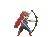
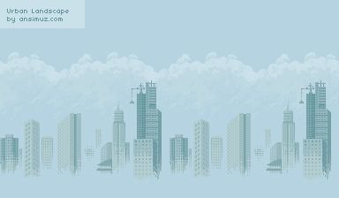
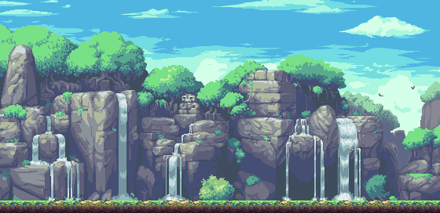

# Here are a few sample resources:

## Sprites:

### Adventurer with bow

 

https://mbardin.github.io/PDM-resources/media/sprite_images/Adventurer/adventurer-bow-00.png

 

 

https://mbardin.github.io/PDM-resources/media/sprite_images/Adventurer/adventurer-bow-01.png

 

 

https://mbardin.github.io/PDM-resources/media/sprite_images/Adventurer/adventurer-bow-02.png

 

 

https://mbardin.github.io/PDM-resources/media/sprite_images/Adventurer/adventurer-bow-03.png

 

 

https://mbardin.github.io/PDM-resources/media/sprite_images/Adventurer/adventurer-bow-04.png

 

 

https://mbardin.github.io/PDM-resources/media/sprite_images/Adventurer/adventurer-bow-05.png

 

 

https://mbardin.github.io/PDM-resources/media/sprite_images/Adventurer/adventurer-bow-06.png

 

 

https://mbardin.github.io/PDM-resources/media/sprite_images/Adventurer/adventurer-bow-07.png

 

 

https://mbardin.github.io/PDM-resources/media/sprite_images/Adventurer/adventurer-bow-08.png

 

### Anime female stills

 

https://mbardin.github.io/PDM-resources/media/sprite_images/anime female sprites/annoyed1.png

 

 

https://mbardin.github.io/PDM-resources/media/sprite_images/anime female sprites/happy1.png

 

 

https://mbardin.github.io/PDM-resources/media/sprite_images/anime female sprites/sad1.png

 

 

https://mbardin.github.io/PDM-resources/media/sprite_images/anime female sprites/sleepy2.png

 

### Planets

 

https://mbardin.github.io/PDM-resources/media/sprite_images/Planets/Baren.png

 

 

https://mbardin.github.io/PDM-resources/media/sprite_images/Planets/Ice.png

 

 

https://mbardin.github.io/PDM-resources/media/sprite_images/Planets/Lava.png

 

 

https://mbardin.github.io/PDM-resources/media/sprite_images/Planets/Terran.png

 

### Slime

 

https://mbardin.github.io/PDM-resources/media/sprite_images/Slime/slime-attack-0.png

 

 

https://mbardin.github.io/PDM-resources/media/sprite_images/Slime/slime-attack-1.png

 

 

https://mbardin.github.io/PDM-resources/media/sprite_images/Slime/slime-attack-2.png

 

 

https://mbardin.github.io/PDM-resources/media/sprite_images/Slime/slime-attack-3.png

 

 

https://mbardin.github.io/PDM-resources/media/sprite_images/Slime/slime-attack-4.png

 

### Backgrounds

 

https://mbardin.github.io/PDM-resources/media/sprite_images/background/back1.jpg

 

 

https://mbardin.github.io/PDM-resources/media/sprite_images/background/back5.jpg

 

 

https://mbardin.github.io/PDM-resources/media/sprite_images/background/Background1.png

 

 

https://mbardin.github.io/PDM-resources/media/sprite_images/background/Background2.gif

 

potential more to come. Explore the github repo for additional sprites. in the docs/media folder. https://github.com/mbardin/PDM-resources

---

## Audio Samples:

Coming Soon!!

--
