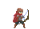
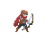
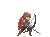
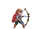
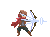
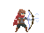

# Here are a few sample resources:

## Sprites:

### Adventurer with bow

 

https://mbardin.github.io/PDM-resources/media/sprite_images/Adventurer/adventurer-bow-00.png

 

 

https://mbardin.github.io/PDM-resources/media/sprite_images/Adventurer/adventurer-bow-01.png

 

 

https://mbardin.github.io/PDM-resources/media/sprite_images/Adventurer/adventurer-bow-02.png

 

 

https://mbardin.github.io/PDM-resources/media/sprite_images/Adventurer/adventurer-bow-03.png

 

 

https://mbardin.github.io/PDM-resources/media/sprite_images/Adventurer/adventurer-bow-04.png

 

 

https://mbardin.github.io/PDM-resources/media/sprite_images/Adventurer/adventurer-bow-05.png

 

 

https://mbardin.github.io/PDM-resources/media/sprite_images/Adventurer/adventurer-bow-06.png

 

 

https://mbardin.github.io/PDM-resources/media/sprite_images/Adventurer/adventurer-bow-07.png

 

 

https://mbardin.github.io/PDM-resources/media/sprite_images/Adventurer/adventurer-bow-08.png

 

### Anime female stills

 

https://mbardin.github.io/PDM-resources/media/sprite_images/anime female sprites/annoyed1.png

 

 

https://mbardin.github.io/PDM-resources/media/sprite_images/anime female sprites/happy1.png

 

 

https://mbardin.github.io/PDM-resources/media/sprite_images/anime female sprites/sad1.png

 

 

https://mbardin.github.io/PDM-resources/media/sprite_images/anime female sprites/sleepy2.png

 

### Planets

 

https://mbardin.github.io/PDM-resources/media/sprite_images/Planets/Baren.png

 

 

https://mbardin.github.io/PDM-resources/media/sprite_images/Planets/Ice.png

 

 

https://mbardin.github.io/PDM-resources/media/sprite_images/Planets/Lava.png

 

 

https://mbardin.github.io/PDM-resources/media/sprite_images/Planets/Terran.png

 

### Slime

 

https://mbardin.github.io/PDM-resources/media/sprite_images/Slime/slime-attack-0.png

 

 

https://mbardin.github.io/PDM-resources/media/sprite_images/Slime/slime-attack-1.png

 

 

https://mbardin.github.io/PDM-resources/media/sprite_images/Slime/slime-attack-2.png

 

 

https://mbardin.github.io/PDM-resources/media/sprite_images/Slime/slime-attack-3.png

 

 

https://mbardin.github.io/PDM-resources/media/sprite_images/Slime/slime-attack-4.png

 

### Backgrounds

 

https://mbardin.github.io/PDM-resources/media/sprite_images/background/back1.jpg

 

 

https://mbardin.github.io/PDM-resources/media/sprite_images/background/back5.jpg

 

 

https://mbardin.github.io/PDM-resources/media/sprite_images/background/Background1.png

 

 

https://mbardin.github.io/PDM-resources/media/sprite_images/background/Background2.gif

 

### Bug-Squish Project Sprites

 

https://mbardin.github.io/PDM-resources/media/sprite_images/bug_squish/bugsprite_1.png

 

 

https://mbardin.github.io/PDM-resources/media/sprite_images/bug_squish/bugsprite_2.png

 

 

https://mbardin.github.io/PDM-resources/media/sprite_images/bug_squish/bugsprite_3.png

 

 

https://mbardin.github.io/PDM-resources/media/sprite_images/bug_squish/bugsprite_4.png

 

 

https://mbardin.github.io/PDM-resources/media/sprite_images/bug_squish/background.jpg.png

 

Potentially more to come. Explore the github repo for additional sprites. All are located in the in the docs/media folder. https://github.com/mbardin/PDM-resources

Build the url to link to the images as shown in the video below:

---

## Audio Samples:

beep

 

<audio controls src="sound_samples/short_effects/beep4.wav"></audio>

 

click

 

<audio controls src="sound_samples/short_effects/camera-click-nikon.wav"></audio>

 

lazer

 

<audio controls src="sound_samples/short_effects/lazercannon.ogg"></audio>

 

brush

 

<audio controls src="sound_samples/short_effects/paint-brush-07.wav"></audio>

 

bees

 

<audio controls src="sound_samples/short_effects/Bee.mp3"></audio>

 

---

## Linking these resources to a p5 sketch for the PDM course:

<iframe width="560" height="315" src="https://www.youtube.com/embed/5SJTPAeRCbw" frameborder="0" allow="accelerometer; autoplay; clipboard-write; encrypted-media; gyroscope; picture-in-picture" allowfullscreen></iframe>
